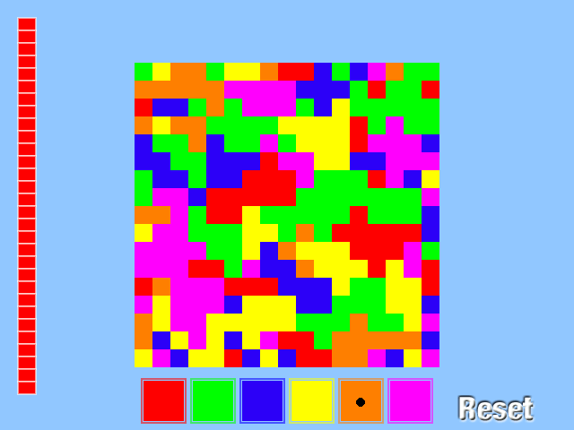

# LÖVE INK SPILL
Visualization of the FloodFill algorithm using the Love2D framework. 
The project is based on this [example](https://inventwithpython.com/inkspill.py), which is written in pygame. I recommend that you read it and other examples.

## Screenshots

## Addons
* [Love2D](https://love2d.org) - website of LÖVE.
* [Biopushy module](https://github.com/a327ex/boipushy) - github page
* [Pygame examples](https://inventwithpython.com/pygame/) - great a pygame book with examples
